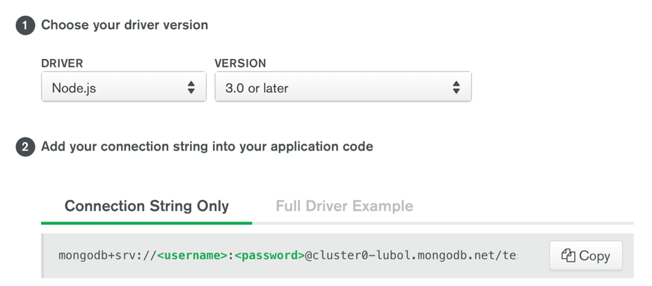

# Heart Tracker MERN App

A MERN (Mongodb, ExpressJS, ReactJS, NodeJS) app where patients can log their health details and keep a track of their heart performance. 

## Prerequisites
1. Install MongoDB.
2. Install [NodeJS](https://nodejs.org/en/download/)
3. Sign up for a mongoDB instance: https://mlab.com/signup/

## Steps

1. Creating Mongodb cluster:

 - Choose Free Tier and Create the cluster.
 
   It’ll take between 7-10 minutes to provision. Follow this checklist to get started. 
 
 - Whitelist the IP Address: 0.0.0.0/0 
 
 - Create a Database User. Choose **Atlas Admin**. Set a username and password and save it.
 
 - Click **Choose a  Connection method**. Select **Connect your application**. Copy the connection string and Replace <password> with the password for the <username> user, as shown below:
 
 
 
 - Click on Collections. Create a database. Name it **Patient Info**.
 
 2. Download or Clone this repo.
 
 3. Open the **config.json** file in the backend folder. Paste the connection string copied from Mongodb. **Save Changes**.
 
 4. Open two terminals to open the directory to backend and frontend folders separately. 
 
     Run **npm start** in both terminals to run your app!
 
 
 
 
